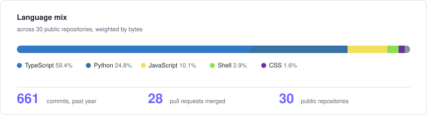

<div align="center">

```
███╗   ███╗██╗██╗      █████╗ ███╗   ██╗    ███████╗ ██████╗ ███╗   ██╗██╗
████╗ ████║██║██║     ██╔══██╗████╗  ██║    ██╔════╝██╔═══██╗████╗  ██║██║
██╔████╔██║██║██║     ███████║██╔██╗ ██║    ███████╗██║   ██║██╔██╗ ██║██║
██║╚██╔╝██║██║██║     ██╔══██║██║╚██╗██║    ╚════██║██║   ██║██║╚██╗██║██║
██║ ╚═╝ ██║██║███████╗██║  ██║██║ ╚████║    ███████║╚██████╔╝██║ ╚████║██║
╚═╝     ╚═╝╚═╝╚══════╝╚═╝  ╚═╝╚═╝  ╚═══╝    ╚══════╝ ╚═════╝ ╚═╝  ╚═══╝╚═╝
```

### AI Engineer · Backend & Full Stack Developer

<a href="https://milansoni.vercel.app"></a>

<p>
  <a href="https://milansoni.vercel.app"></a>
  <a href="https://www.linkedin.com/in/sonimilan"></a>
  <a href="https://medium.com/@milansoni96946"></a>
  <a href="mailto:milansoni96946@gmail.com"></a>
</p>

<p>
  
  
  
</p>

</div>

---

## 👋 About

```yaml
name:       Milan Soni
role:       AI Engineer · Backend & Full Stack Developer
location:   Churu, Rajasthan, India
education:  B.Tech CSE @ Global Institute of Technology, Jaipur — CGPA 8.10/10 ('26)
recognition:
  - SIH 2023 National Winner — Ministry of Coal, top 1% of 44,000+ teams
  - Scopus-indexed publication — PiCET-2026 (IET Conference Proceedings)
open_source: 6 PRs merged into OmniRoute — 53k★ AI gateway, 230+ providers, 21,000+ tests
open_to:    [Full-time roles, Freelance projects, AI consulting]
```

I build production RAG pipelines, multi-agent LLM systems, and the backends that hold them
up — in Python and TypeScript. The through-line in my work is **measurement**: retrieval
quality scored against a labelled golden set and enforced as a blocking CI gate, failure
modes surfaced rather than swallowed, and limitations written down instead of rounded up.

---

## 🧩 What I Build

<table>
<tr>
<td width="33%" valign="top">

### 🤖 AI / LLM Engineering
Production RAG with hybrid search and cross-encoder reranking · multi-agent orchestration
(5 agents, **no framework** — hand-written on `asyncio.gather()`) · quota-aware provider
failover · retrieval + generation eval harnesses

</td>
<td width="33%" valign="top">

### 🖥️ Backend & Full Stack
FastAPI · Node.js/Express · SQLAlchemy · Pydantic v2 · React 19 + Next.js 16 frontends ·
Clerk/JWT auth with RBAC · SSE streaming · REST API design

</td>
<td width="33%" valign="top">

### 🗄️ Data & Infra
PostgreSQL + pgvector (HNSW) · Redis vector search · Supabase · Docker Compose ·
GitHub Actions CI/CD · **$0/month** free-tier production deployments

</td>
</tr>
</table>

---

## 🚀 Featured Projects

<table>
<tr>
<td width="50%" valign="top">

### 🏆 [MiningNiti](https://github.com/Iammilansoni/MiningNiti)
**AI document intelligence & compliance for mining**
`SIH 2023 National Winner` · `Solo rebuild, Jun 2025 →`

5 specialized agents across 4 providers — 4 run on upload (classifier first, then three
concurrently), a 5th audits compliance on demand. **No agent framework:** orchestration is
hand-written on `asyncio.gather()` with per-agent error isolation and quota-aware failover.
Hybrid retrieval (pgvector HNSW **+ Postgres full-text**, fused with Reciprocal Rank
Fusion) then cross-encoder reranked — **gated in CI at Hit Rate@5 1.000**, at $0/month.

`FastAPI` `Next.js 16` `React 19` `pgvector` `Supabase` `Upstash` `Clerk` `Docker`

[🔗 Code](https://github.com/Iammilansoni/MiningNiti) · [🌐 Live](https://miningniti.vercel.app/) · [📖 Spotlight](#-miningniti--the-flagship)

</td>
<td width="50%" valign="top">

### 📄 [HATF Early Warning](https://github.com/Iammilansoni/hatf-lms-early-warning-poc)
**A Scopus-indexed paper, shipped as a product**
`PiCET-2026 · IET Proceedings`

Early dropout prediction from week 2 of an 8-week course. A 59,951-parameter model —
causal CNN → LSTM → masked temporal attention → MC-dropout — where causality is
*structural*, not conventional. It explains every score, quantifies its own uncertainty
(**28.4%** escalated to a human), and audits its own fairness. Eleven baselines were
trained and the table is published **even though the proposed model loses**.

`PyTorch` `FastAPI` `Next.js 15` `scikit-learn` `Docker` `Render`

[🔗 Code](https://github.com/Iammilansoni/hatf-lms-early-warning-poc) · [🌐 Live](https://hatf-lms-early-warning-poc.vercel.app/)

</td>
</tr>
<tr>
<td width="50%" valign="top">

### ⚡ [NLPForge](https://github.com/Iammilansoni/NLPFT-2)
**NL → executable API test cases**
`Built at nTheta Works`

Two-stage retrieval: Ollama embeddings → Redis Stack HNSW KNN → FlashRank cross-encoder
reranking, with LLM slot extraction across **8 providers** and 15+ embedding models.
**+40%** template-matching accuracy, **−60%** manual QA effort.

`FastAPI` `Next.js 16` `SQLAlchemy 2.0` `PostgreSQL` `Redis Stack` `FlashRank`

[🔗 Code](https://github.com/Iammilansoni/NLPFT-2)

</td>
<td width="50%" valign="top">

### 🎓 SmartLearnX
**AI-powered Learning Management System**
`Freelance`

Adaptive LMS with dropout prediction (Logistic Regression, **91.4%** accuracy) and
performance forecasting (Random Forest, **R² = 0.89**) served from a FastAPI microservice,
plus BERT quiz generation and a spaCy chatbot answering under 2s at load.

`React` `TypeScript` `Node.js` `FastAPI` `MongoDB` `Redis` `Docker`

</td>
</tr>
</table>

---

## 🏆 MiningNiti — the flagship

> **Two builds, four years apart.** The Smart India Hackathon 2023 entry — a *team*
> prototype against the Ministry of Coal problem statement — won the National Finale and
> was recognized by Coal India Limited & CMPDI. **This repository is not that codebase.**
> It is an independent, ground-up rebuild started June 2025 and developed solo since, with
> none of the 2023 code carried over: a production system rather than a hackathon demo.

<table>
<tr><td>

**The 2023 prototype** → single-pass LangChain RAG chatbot over FAISS, running locally.

**Today** → 5 agents across 3 LLM providers with quota-aware failover, hybrid retrieval
with cross-encoder reranking, a blocking retrieval-quality CI gate, Clerk JWT auth with
SSRF and prompt-injection guards, and 36 REST endpoints live on free-tier infrastructure.

</td></tr>
</table>

```
Document Upload
      │
      ▼
  Classifier ─────── Groq · runs FIRST, its category feeds the rest
 (gpt-oss-120b)
      │
 ┌────┴──────┬──────────────┐   asyncio.gather()
 ▼           ▼              ▼
Safety     Entity       Summarizer     ← skipped when the category
Analyzer  Extractor                       doesn't warrant it
(Mistral) (Cerebras)   (Cerebras)
 └────┬──────┴──────────────┘
      ▼
 Chunks + Embeddings → pgvector (HNSW)

 Compliance Auditor (Groq) runs separately, ON DEMAND
 → per-clause Pass / Fail / Not Addressed matrix
```

**Retrieval pipeline** — query → 23 injection-guard patterns + 1,500-char cap → Gemini
`gemini-embedding-001` (768-dim) → pgvector cosine (HNSW) fused with Postgres full-text
`ts_rank_cd` via Reciprocal Rank Fusion (k=60) → over-fetch 20 → `ms-marco-MiniLM-L-6-v2`
cross-encoder rerank to top 5 → streamed over SSE with inline `[Document, Page X]`
citations.

> The lexical arm is PostgreSQL full-text search, **not true BM25** — real BM25 needs an
> extension like `pg_search`. Everyone writes "hybrid BM25 + vector"; I'd rather be precise
> than round up.

**Retrieval quality — a blocking CI gate**, scored on 12 labelled queries over a 130-chunk
mining corpus. If it drops below the floor, the build fails:

| Metric | Floor | Current |
|:--|:--:|:--:|
| Hit Rate@5 | 0.90 | **1.000** |
| MRR | 0.75 | **1.000** |
| Recall@5 | 0.85 | **0.958** |
| nDCG@5 | 0.75 | **0.968** |

<sub>**242 tests** run green as blocking gates on every push (215 unit + 27 integration);
274 collected once the eval suites are counted · 27.1K lines across two apps ·
$0/month infrastructure.</sub>

---

## 💼 Experience

<table>
<tr>
<td width="22%" valign="top"><b>Jul 2026 –<br/>Present</b></td>
<td width="78%" valign="top">

**Open Source Contributor · [OmniRoute](https://github.com/diegosouzapw/OmniRoute)** — *Remote*
Universal AI gateway — **53k★**, 230+ LLM providers, 21,000+ tests. **6 PRs merged** across
backend schema design, provider integrations, routing logic and frontend.

</td>
</tr>
<tr>
<td valign="top"><b>Oct – Dec<br/>2025</b></td>
<td valign="top">

**Full Stack Developer Intern · nTheta Works Pvt. Ltd.** — *Remote*
Engineered a two-stage semantic retrieval pipeline (Ollama embeddings → Redis HNSW →
FlashRank reranking) for NLPForge, an enterprise LLM API-testing platform — **+40%**
template-matching accuracy, **−60%** manual QA effort. Shipped async FastAPI microservices
and Next.js/TypeScript dashboards, containerized with Docker Compose and CI/CD on Linux.

</td>
</tr>
<tr>
<td valign="top"><b>Jul – Aug<br/>2025</b></td>
<td valign="top">

**AI & Full Stack Developer · Freelance** — *Remote*
Built SmartLearnX, an AI-powered LMS with dropout prediction (Logistic Regression,
**91.4%**) and performance forecasting (Random Forest, **R² = 0.89**) deployed as a FastAPI
microservice behind a React/Node.js frontend. Added BERT quiz generation and a spaCy
chatbot serving sub-2-second responses under load.

</td>
</tr>
<tr>
<td valign="top"><b>May – Jul<br/>2025</b></td>
<td valign="top">

**Full Stack Developer Intern · OBG Outsourcing Pvt. Ltd.** — *Jaipur*
Led FinSageAI360, a multi-tenant financial-intelligence SaaS — cut monthly close reporting
time by **45%** and manual operational effort by **30%** via AI anomaly detection and
real-time KPI dashboards. Designed a JWT-authenticated REST API (Node.js/Express/MongoDB)
with granular RBAC for multi-tenant data isolation.

</td>
</tr>
<tr>
<td valign="top"><b>Jun – Aug<br/>2024</b></td>
<td valign="top">

**Software Developer Intern · Om Logistics Ltd.** — *Delhi*
Optimized enterprise document search with LangChain + FAISS embeddings — **−70%** query
latency across 10,000+ documents and **+40%** retrieval accuracy. Built Node.js REST APIs
automating logistics workflows, eliminating 20% of manual data entry.

</td>
</tr>
</table>

---

## 🔧 Open Source — OmniRoute

<sub>A 53k★ universal AI gateway: one OpenAI-compatible endpoint over 230+ providers, MCP server, A2A protocol, 21,000+ tests.</sub>

| PR | What it took | Impact |
|:--|:--|:--|
| [**#9397**](https://github.com/diegosouzapw/OmniRoute/pull/9397) | Enforce `gemini-web` reasoning and tool constraints — provider capabilities modelled declaratively rather than patched at the call site | Fixes malformed requests to a strict provider |
| [**#9353**](https://github.com/diegosouzapw/OmniRoute/pull/9353) | Correct reset-window strategy prioritization in the router | Routing picks the right provider under quota pressure |
| [**#6366**](https://github.com/diegosouzapw/OmniRoute/pull/6366) | Dynamic import for MITM + fixed Turbopack over-bundling warnings | Smaller bundle, clean build output |
| [**#6245**](https://github.com/diegosouzapw/OmniRoute/pull/6245) | Accessible **"Configured Only"** filter for provider rankings — live `/api/providers` state → filterable grid, `role="switch"` + `aria-checked`, `useEffect` cleanup | 168 additions / 4 files, 9/9 tests, shipped v3.8.45 |
| [**#6209**](https://github.com/diegosouzapw/OmniRoute/pull/6209) | **Claude 5 Sonnet** into the `claude_web` provider registry with a regression test | Signed commit merged within hours of the model's release |
| [**#6105**](https://github.com/diegosouzapw/OmniRoute/pull/6105) | Audited 9 core docs + 20+ localized READMEs across **42 locales**; corrected stale architecture facts (routing strategies 13→17, service modules 36→134) | Passed `docs-sync-strict`, zero regressions, v3.8.44 |

**The one I'm proudest of** — [#6225](https://github.com/diegosouzapw/OmniRoute/pull/6225): diagnosed an HTTP 400
regression hitting strict LLM providers (Xiaomi MiMo), caused by system-message ordering in
the memory-injection pipeline. Rather than special-casing the provider, I proposed a
**declarative Zod schema flag** — `systemMessageMustBeFirst` — which the maintainer adopted
into the broader shipped fix. 25/25 Vitest + 30/30 Node test-runner coverage.

---

## 🛠️ Tech Stack

<div align="center">

**Languages**<br/>


**AI / ML**<br/>


**LLM Providers**<br/>


**Backend & Frontend**<br/>


**Data & Infra**<br/>


</div>

---

## 📊 GitHub

<div align="center">



<picture>
  <source media="(prefers-color-scheme: dark)" srcset="https://github-readme-activity-graph.vercel.app/graph?username=iammilansoni&hide_border=true&theme=tokyo-night&bg_color=0D1117&color=6C63FF&line=6C63FF&point=ffffff" />
  
</picture>

</div>

<sub>The card above is generated from the GitHub API by
<a href="scripts/gen_stats.py"><code>scripts/gen_stats.py</code></a> and refreshed weekly — a
committed file rather than a live third-party widget, because the public
<code>github-readme-stats</code> instance is currently paused (HTTP 503) and its cards were
rendering as broken images here.</sub>

---

## ✍️ Writing

Long-form engineering write-ups on what actually broke and why:

- 📝 [**How I Built a Production-Grade Multi-Agent AI System That Won a National Hackathon**](https://milansoni.vercel.app/blog/building-multi-agent-ai) — the 5-agent architecture, and what real-world GenAI cost me to learn
- 📝 [**Stop Overpaying for Vector DBs: A Production Hybrid RAG Pipeline for $0/Month**](https://milansoni.vercel.app/blog/hybrid-rag-pipeline-zero-cost) — pgvector + Postgres full-text + RRF, and where the free tiers actually bite
- 📝 [**The State Machine Paradigm: Why I Ditched Linear LLM Chains for LangGraph**](https://milansoni.vercel.app/blog/langgraph-multi-agent-state-machine) — per-agent error isolation, conditional branching, fallback routed by token budget
- 📝 [**RSC + Streaming LLMs: A Zero-Latency AI Dashboard with Next.js Server Actions**](https://milansoni.vercel.app/blog/rsc-streaming-llms-nextjs)

More on [my blog](https://milansoni.vercel.app/blog) and [Medium](https://medium.com/@milansoni96946).

---

## 🎓 Education & Credentials

**B.Tech, Computer Science & Engineering** — Global Institute of Technology, Jaipur
*Oct 2022 – Apr 2026 · CGPA **8.10/10***

- 🏆 **Smart India Hackathon 2023 — National Winner** · Ministry of Coal, top 1% of 44,000+ teams
- 📄 **Scopus-Indexed Publication** — PiCET-2026 (IET Conference Proceedings): hybrid attention-based temporal modeling
- 📜 **NASSCOM Certified** Full Stack Developer (2024)
- 🎪 **CodeFiesta Organizer** — sponsorship lead across editions 3.0 and 4.0

---

<div align="center">

### 🤝 Let's build something measurable

[](https://milansoni.vercel.app)
[](https://www.linkedin.com/in/sonimilan)
[](https://medium.com/@milansoni96946)
[](mailto:milansoni96946@gmail.com)

**💡 Open for full-time roles, freelance projects, and AI consulting.**


</div>
